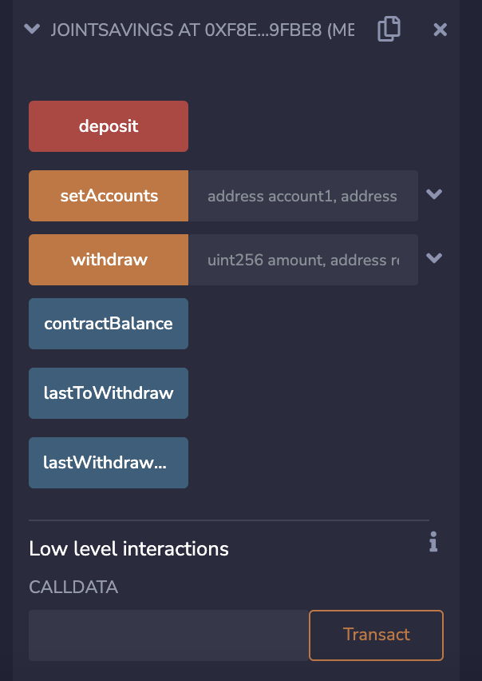
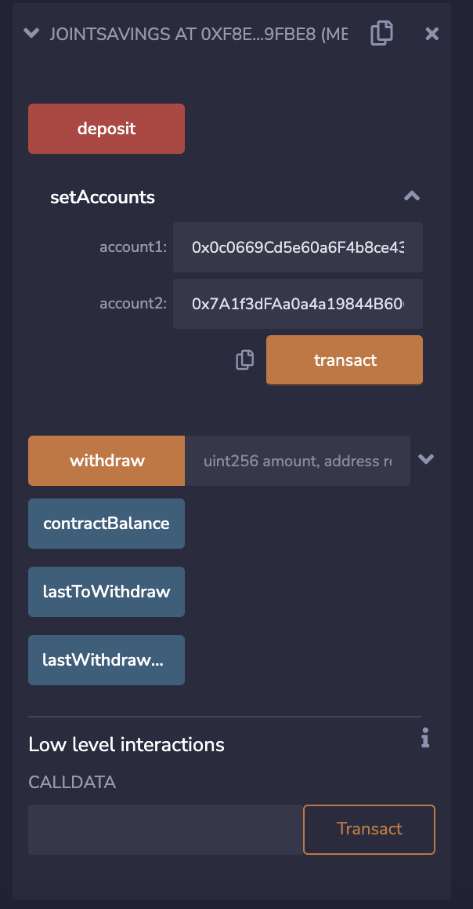
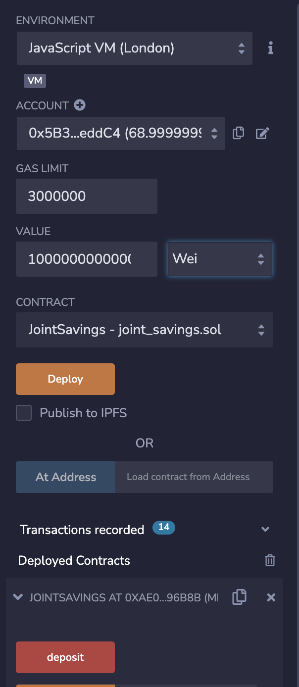
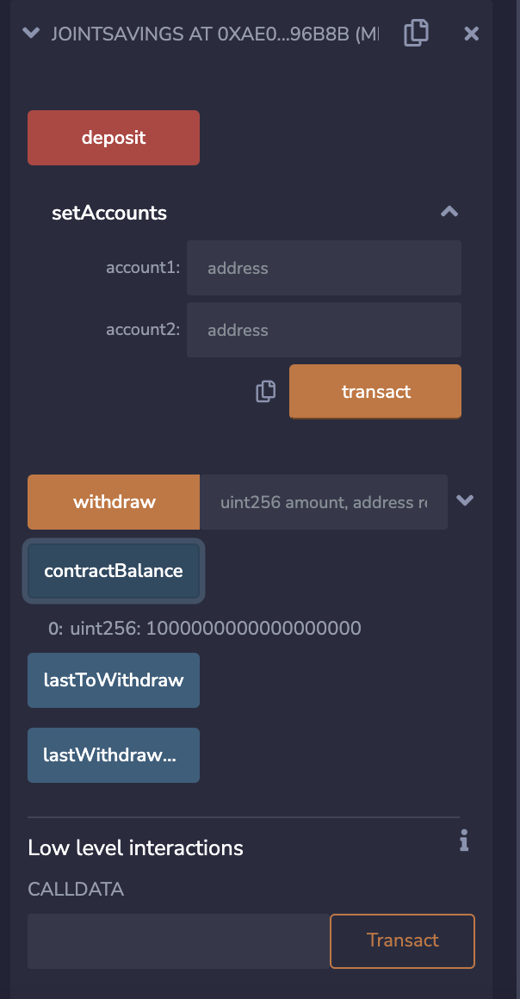
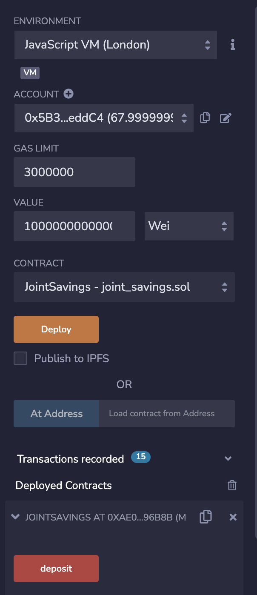
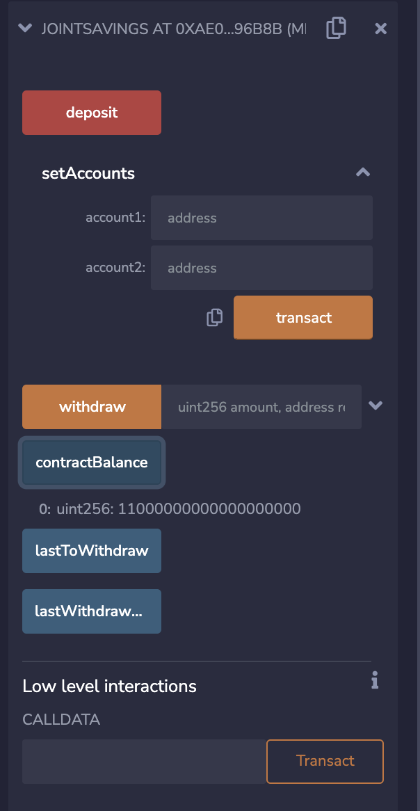
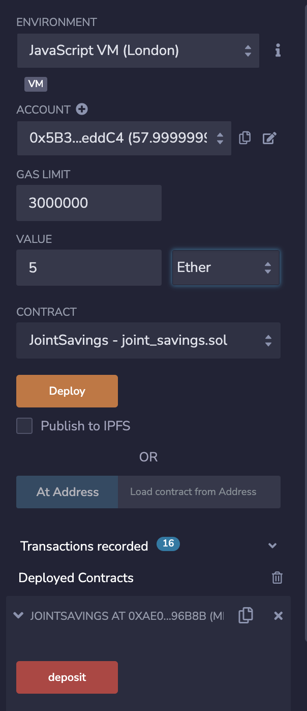
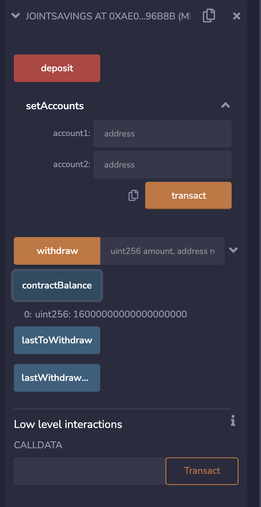
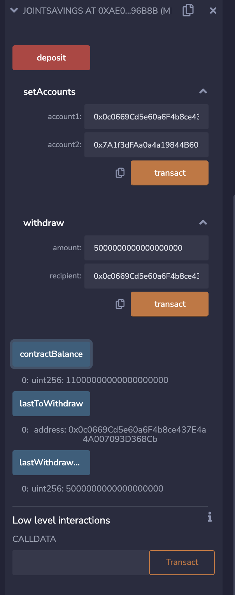
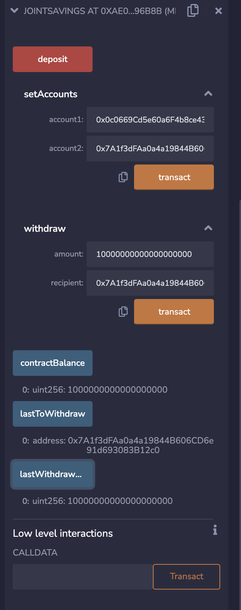

# Solidity-Homework

## Homework Objectives:

1. Create a Joint Savings Account Contract in Solidity
2. Compile and Deploy Your Contract in the JavaScript VM
3. Interact with Your Deployed Smart Contract

## Execution Results:

**Deploy Smart Contract**
---

**Set Account Addresses**
---

**Deposit 1 Ether as Wei to Contract**
---

**View Contract Balance #1**
---

**Deposit 10 Ether as Wei to Contract**
---

**View Contract Balance #2**
---

**Deposit 5 Ether as Ether to Contract**
---

**View Contract Balance #3**
---

**Withdraw 5 Ether to Account 1 & Check Balances**
---

**Withdraw 10 Ether to Account 2 & Check Balances**
---

